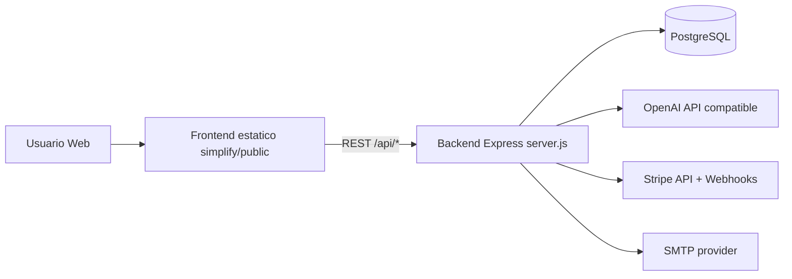

# ARCHITECTURE ANALYSIS - Simplify AI

## 1) Arquitectura general del proyecto

## 1.1 Vision de alto nivel

El repositorio implementa una arquitectura web de tipo **3 capas**:

1. **Frontend estatico (Vanilla JS + HTML + CSS)** servido por Nginx (en Docker) o `python3 -m http.server` en local.
2. **Backend API monolitico (Node.js + Express)** en `backend/server.js`.
3. **Persistencia en PostgreSQL** (o `pg-mem` en tests E2E backend).

Adicionalmente, la API integra servicios externos:
- **OpenAI compatible API** para generacion remota de texto.
- **Stripe** para checkout, webhook y reconciliacion.
- **SMTP/Nodemailer** para OTP por email y recovery de checkout abandonado.

## 1.2 Flujo de componentes

## 1.3 Caracteristicas arquitectonicas relevantes

- **Monolito backend**: toda la logica de negocio, datos, auth y billing esta en un solo archivo (`server.js`).
- **Frontend modular sin bundler**: modulos JS separados por responsabilidad, coordinados por un bootstrap global (`SimplifyApp`).
- **Modelo freemium** con control server-side de cuota (`free_uses` + creditos pagos).
- **Operacion orientada a producto**: eventos, funnel, metricas admin, y modulo de recovery de checkout.
- **Hardening operativo**: rate limiting por endpoint, headers de seguridad, request-id/log estructurado, validaciones de config para produccion.

---

## 2) Estructura del backend

## 2.1 Estructura fisica

Ruta principal: `backend/`

- `server.js`: API completa (routing, negocio, DB, integraciones).
- `package.json`: scripts y dependencias runtime/dev.
- `Dockerfile`: imagen productiva basada en `node:22-alpine`.
- `tests/`
  - `e2e.auth-billing.test.mjs`: E2E API con `node:test`.
  - `ui/app.critical-flows.spec.mjs`: E2E UI Playwright.
- `sql/`
  - `seed_demo.sql`: seed de datos demo.
  - `dashboard_queries.sql`: consultas BI/KPI.

## 2.2 Organizacion logica de `server.js`

El backend sigue una estructura interna por capas (aunque en un solo archivo):

1. **Configuracion**
   - Carga env con `dotenv`.
   - Construye `CONFIG` (puerto, DB, OpenAI, Stripe, JWT, recovery, limites por plan, etc.).
   - Valida seguridad en produccion con `assertProductionSafety()`:
     - bloquea secretos default para JWT/OTP,
     - bloquea `SHOW_DEV_OTP` en produccion,
     - bloquea `FRONTEND_ORIGINS="*"`.

2. **Infraestructura HTTP / middleware**
   - Express app con:
     - `requestContextMiddleware` (x-request-id + latencia),
     - `securityHeadersMiddleware` (nosniff, frame deny, referrer-policy, COOP/CORP, HSTS bajo HTTPS),
     - CORS por allowlist de origins,
     - parser raw para webhook Stripe,
     - parser JSON global.
   - Rate limiters in-memory por dominio funcional (auth, ai, checkout, admin, etc.).

3. **Persistencia y migraciones**
   - `createDatabaseRuntime()`:
     - PostgreSQL real (`pg`) en runtime normal,
     - `pg-mem` para tests (`USE_PG_MEM=1`).
   - `runMigrations()` crea/actualiza schema de forma idempotente.

4. **Servicios de dominio**
   - Auth (anonimo, OTP email, Google).
   - Billing/credits/plans y checkout.
   - Legal consent versionado.
   - AI generation con cuota y limites por plan.
   - Recovery de checkout (secuencia de emails + A/B + anti-fatiga).
   - Admin metrics/reconcile/credit grant/plan assign/marketing spend.

5. **Integraciones externas**
   - Stripe checkout/webhooks.
   - OpenAI chat completions.
   - SMTP para OTP y recovery.

6. **Ciclo de vida**
   - `startServer()`:
     - valida seguridad de config,
     - ejecuta migraciones,
     - inicia HTTP listener,
     - levanta timer periodico de recovery.
   - `stopServer()`:
     - frena timer,
     - cierra servidor y pool.

## 2.3 Endpoints principales (por dominio)

**Health**
- `GET /api/health`

**Auth**
- `POST /api/auth/session/anonymous`
- `GET /api/auth/me`
- `POST /api/auth/email/request-code`
- `POST /api/auth/email/verify-code`
- `POST /api/auth/google`
- `POST /api/auth/logout`

**Legal**
- `POST /api/legal/consent`
- `GET /api/legal/consent-status`

**Monetizacion / pagos**
- `GET /api/pay/plans`
- `POST /api/pay/checkout`
- `GET /api/pay/checkout-status`
- `GET /api/pay/balance`
- `POST /api/pay/consume`
- `POST /api/pay/webhook`

**Eventos y AI**
- `POST /api/events/track`
- `POST /api/ai/generate`

**Admin**
- `GET /api/admin/metrics`
- `POST /api/admin/credits/grant`
- `POST /api/admin/plan/assign`
- `POST /api/admin/marketing/spend`
- `POST /api/admin/recovery/checkout/run`
- `GET /api/admin/recovery/checkout/stats`
- `POST /api/admin/reconcile/payments`

## 2.4 Modelo de datos (tablas)

El schema es creado en runtime por migraciones:

- `app_users`: identidad de usuario, rol, proveedor auth.
- `user_credits`: ledger simplificado (creditos, free uses, plan tier, estado suscripcion).
- `payment_sessions`: sesiones de pago + estado recovery.
- `processed_invoices`: idempotencia de invoices Stripe.
- `webhook_events`: idempotencia de eventos webhook.
- `email_login_codes`: OTP hash/TTL/intentos.
- `app_events`: telemetria de producto.
- `legal_consents`: consentimiento legal versionado.
- `marketing_costs`: costos por canal para unit economics.

Indices en campos de consulta frecuente (customer_id, status, fechas, event_name, etc.).

## 2.5 Seguridad backend

- JWT auth y control admin via `x-admin-key` o rol `admin`.
- Sanitizacion y normalizacion de inputs (email, customerId, legal version/source, plan tier, etc.).
- Hash de OTP con pepper (`OTP_PEPPER`) y SHA-256.
- Hash parcial de IP para almacenamiento en consent.
- Rate limiting por endpoint.
- Webhook Stripe con verificacion de firma e idempotencia en DB.

---

## 3) Estructura del frontend

## 3.1 Estructura fisica

Ruta principal: `simplify/public/`

- `index.html`: shell UI principal.
- `styles.css` + `css/*.css`: estilos visuales.
- Modulos funcionales JS:
  - `pay.config.js`
  - `pay.guard.js`
  - `auth.client.js`
  - `pay.ui.js`
  - `ai.client.js`
  - `main.js`
  - `chips.js`
  - `admin.panel.js`
  - `js/app-wire.js`
  - `js/result-router.js`
  - `js/admin-mode.js`
  - `js/admin-bypass.js`
  - `js/sky.js`
- `legal/*.html`: paginas legales estaticas.
- `pulse/*.svg`: branding assets.

## 3.2 Patron de inicializacion

El frontend usa un bus simple de inicializacion:

- `pay.config.js` crea `window.SimplifyApp` y registra cola `_initQueue`.
- Cada modulo registra su init con `SimplifyApp.registerInit(name, fn)`.
- `js/app-wire.js` ejecuta `runInitializers()` al cargar DOM.

Esto reemplaza un framework SPA y mantiene desacoplamiento basico entre modulos.

## 3.3 Responsabilidades por modulo

- **`pay.config.js`**: configuracion central (API base, paths, storage keys, auth, legal, monetizacion).
- **`pay.guard.js`**: estado local de cuota/creditos, sincronizacion con backend, consumo remoto y tracking.
- **`auth.client.js`**: sesion anonima, OTP email, Google login, almacenamiento de token/usuario.
- **`pay.ui.js`**: render de precios, checkout, reconciliacion por `session_id`, consentimiento legal.
- **`ai.client.js`**: cliente remoto para `/api/ai/generate` (modo generic/openai), timeout y parsing de respuestas.
- **`main.js`**: logica de transformaciones, refinamientos, tabs, historial local y orquestacion de acciones.
- **`chips.js`**: selector de accion rapida.
- **`admin.panel.js`**: UI admin para metricas/reconcile/grants/plan/recovery.
- **`result-router.js`**: enrutado por hash/query para tabs de salida.
- **`admin-mode.js` / `admin-bypass.js`**: toggles de modo admin/bypass via query params.

## 3.4 Observaciones de frontend

- No hay bundling ni transpiling: carga directa de scripts.
- CSP esta definida en `index.html` (incluye Google GSI y conexiones al backend/OpenAI).
- Persistencia local via `localStorage` (estado auth, cuota, historial, preferencias, customerId, consent version).

---

## 4) Dependencias principales

## 4.1 Runtime backend (`backend/package.json`)

- `express`: framework HTTP/API.
- `cors`: CORS policy.
- `dotenv`: carga de variables de entorno.
- `pg`: cliente PostgreSQL.
- `stripe`: SDK pagos/subs/webhooks.
- `jsonwebtoken`: emision/validacion JWT.
- `nodemailer`: envio de emails OTP/recovery.
- `pg-mem`: base en memoria para tests E2E backend.

## 4.2 Dev/test

- `@playwright/test`: E2E UI sobre frontend estatico.

## 4.3 Dependencias de plataforma

- Node.js 22 (CI y Docker backend).
- Python 3.12 (script de validacion estatica + servidor estatico en local).
- PostgreSQL 16 (docker-compose).
- Nginx (serving frontend en compose).

---

## 5) Infraestructura de tests

## 5.1 Tests backend API (Node test runner)

Archivo: `backend/tests/e2e.auth-billing.test.mjs`

Cobertura principal:
- sesion anonima + OTP email,
- consentimiento legal,
- consumo de cuota/free uses en AI,
- grant/consume de creditos,
- enforcement de limites por plan y upgrade admin,
- recovery de checkout (secuencia, A/B, anti-fatiga por actividad),
- metricas admin.

Caracteristicas tecnicas:
- usa `node:test` nativo.
- levanta backend en puerto efimero.
- usa `USE_PG_MEM=1` para evitar dependencia de Postgres real.
- mockea OpenAI via servidor HTTP local.

## 5.2 Tests frontend UI (Playwright)

Archivo: `backend/tests/ui/app.critical-flows.spec.mjs`

Cobertura principal:
- generacion local y guardado en historial.
- login OTP en UI.
- panel admin + checkout mockeado.

Caracteristicas tecnicas:
- `playwright.config.mjs` levanta `python3 -m http.server` sobre `../simplify/public`.
- se interceptan rutas API con `page.route(...)` para no depender de servicios externos.
- reporter HTML (`backend/playwright-report`).

## 5.3 Validaciones estaticas

- `npm run check`: `node --check server.js`.
- `python3 scripts/validate_static.py`: valida que referencias locales de `index.html` existan.
- CI tambien hace `node --check` de varios JS del frontend.

---

## 6) Configuracion de CI/CD

## 6.1 CI (GitHub Actions)

Workflow: `.github/workflows/ci.yml`

Triggers:
- `push` a `main` y `cursor/**`
- `pull_request`

Jobs:

1. **`backend-and-static`**
   - setup Node 22 y Python 3.12
   - `npm ci` en backend
   - `npm run check`
   - `npm test`
   - `python3 scripts/validate_static.py`
   - `node --check` sobre archivos frontend criticos

2. **`frontend-ui-e2e`** (depende de job anterior)
   - setup Node 22 + Python 3.12
   - `npm ci`
   - instala Chromium Playwright (`npx playwright install --with-deps chromium`)
   - ejecuta `npm run test:ui`
   - sube `playwright-report` como artifact

## 6.2 CD / despliegue

- No se observa pipeline de **CD automatizado** en GitHub Actions (no hay job de deploy en el workflow actual).
- El despliegue operativo esta preparado via:
  - `docker-compose.yml` (postgres + backend + frontend + backups),
  - `backend/Dockerfile` para imagen de API.

---

## 7) Conclusiones tecnicas

1. La solucion es un **monolito backend robusto** para un producto SaaS temprano: auth, billing, AI, analytics y recovery en una sola unidad de despliegue.
2. El frontend sigue un enfoque **frameworkless modular**, suficiente para velocidad de iteracion y bajo costo operativo.
3. El esquema de datos y endpoints esta orientado a **monetizacion y growth loops** (checkout, recovery, funnel, unit economics).
4. La CI actual valida correctamente sintaxis, API E2E, UI E2E y consistencia estatica; falta una etapa de CD automatizada.
5. Desde arquitectura, el principal trade-off es mantenibilidad futura de `server.js` (archivo unico grande), aunque funcionalmente cubre bien el dominio actual.
